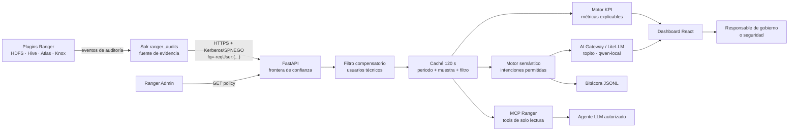
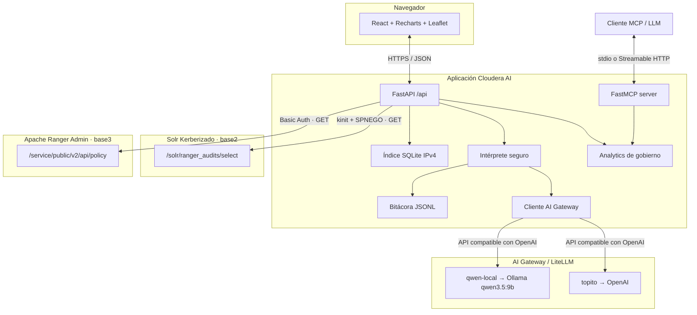

# Ranger Security Intelligence


Plataforma de observabilidad y gobierno para Apache Ranger, preparada para desplegarse como aplicación en Cloudera AI Workbench. Combina una visión ejecutiva de KPIs, trazabilidad de accesos, geolocalización y consultas en lenguaje natural sobre un perímetro estrictamente de solo lectura.

> Estado: MVP funcional. No modifica políticas de Ranger. Las credenciales permanecen en FastAPI y nunca llegan al navegador ni al modelo.

La aplicación incorpora autenticación local mediante contraseña scrypt y sesión firmada en cookie `HttpOnly`. Todo el acceso web se sirve por HTTPS; en desarrollo se utiliza un certificado autofirmado.

## 1. Propósito de gobierno

Apache Ranger conserva la evidencia operativa: quién accedió, a qué activo, desde dónde, mediante qué servicio y con qué decisión. Este proyecto convierte esa evidencia técnica en tres vistas complementarias:

1. **Visión ejecutiva:** indicadores OK/KO para última hora, hoy y muestra seleccionada.
2. **Visión operativa:** usuarios, servicios, recursos, IP, operaciones, políticas y últimos eventos.
3. **Visión semántica:** preguntas en español y herramientas MCP gobernadas para agentes externos.

El producto no sustituye a Ranger. Actúa como una capa de lectura, interpretación y rendición de cuentas.

## 2. Infografía del flujo de datos



La separación entre extracción, cálculo y presentación permite demostrar de dónde sale cada cifra. Es una característica de gobierno, no solo una decisión técnica.

## 3. Funcionalidad

### 3.1 Dashboard

- Ventanas temporales: 24 horas, 7 días, 30 días, 3 meses y 6 meses.
- Muestra configurable en web: 1.000, 5.000, 10.000, 30.000, 50.000 o 100.000 eventos.
- Exclusión activable de usuarios internos.
- KPIs OK/KO para última hora, hoy y muestra.
- Evolución temporal y distribución permitidos/denegados.
- Actividad y denegaciones por usuario.
- Distribución por servicio Ranger.
- Recursos más utilizados, identificados por **servicio + nombre + base de datos/ruta**.
- IP con más denegaciones.
- Últimos 100 accesos permitidos y últimos 100 denegados.
- Inventario y señales básicas de riesgo en políticas.
- Consulta de la bitácora del chat.

### 3.2 Mapa

- Las IP públicas se resuelven localmente con un catálogo IPv4 convertido a SQLite.
- Ninguna IP se envía a un servicio externo de geolocalización.
- Las IP privadas se agrupan en Calle Embajadores 181, Madrid.
- El mapa encuadra todos los puntos con aproximadamente 5 km de margen sobre los extremos.

### 3.3 Lenguaje natural

El chat no convierte texto libre en URLs, SQL ni acciones administrativas. Clasifica la pregunta dentro de un catálogo permitido y responde con:

- una conclusión textual;
- una tabla cuando aporta evidencia;
- una gráfica cuando facilita la comparación.

Ejemplos:

- `Desglosa los accesos por usuario.`
- `Usuarios que han accedido y a qué servicio.`
- `¿Qué recursos fueron los más solicitados?`
- `Dime los accesos de la última hora.`
- `Muéstrame políticas con comodines.`
- `¿Qué APIs puedes llamar?`

## 4. Visión de KPIs

| Dominio | KPI | Interpretación de gobierno |
|---|---|---|
| Acceso | OK/KO última hora | Pulso operativo y detección temprana |
| Acceso | OK/KO hoy | Situación diaria para operaciones |
| Acceso | OK/KO muestra | Postura del periodo seleccionado |
| Identidad | Accesos por usuario | Concentración de uso y cuentas dominantes |
| Identidad | Usuarios más denegados | Posible error de asignación, abuso o política incompleta |
| Activo | Recursos más usados | Activos críticos por evidencia de consumo |
| Servicio | Accesos por repositorio | Distribución de carga y superficie gobernada |
| Red | IP con denegaciones | Investigación de origen y patrones anómalos |
| Política | Políticas amplias | Comodines, exposición pública o delegación administrativa |

### Alcance y denominadores

Toda métrica se calcula sobre una **muestra explícita**, no necesariamente sobre el universo histórico. El pie de la web muestra el tamaño solicitado y la respuesta API incluye `sampleSize`. Aumentar la muestra mejora cobertura pero incrementa el coste sobre Ranger.

## 5. Arquitectura



### Decisiones principales

- **Backend for Frontend:** React solo llama a FastAPI; no conoce credenciales Ranger.
- **Solo lectura por construcción:** el cliente únicamente implementa GET de auditorías y políticas.
- **Defensa en profundidad:** `excludeUser` se envía a Ranger y vuelve a comprobarse en FastAPI.
- **Cálculos puros:** `analytics.py` no hace red, facilitando revisión y pruebas.
- **Despliegue único:** React se compila y FastAPI sirve el resultado.
- **MCP cerrado:** las tools exponen casos de gobierno concretos, no un proxy HTTP genérico.

## 6. MCP para hablar con Ranger

El servidor MCP está en `backend/mcp_server.py` y utiliza el SDK oficial de Python. Expone exclusivamente:

| Tool MCP | Función | Escritura |
|---|---|---|
| `ranger_access_kpis` | KPIs, evolución, usuarios y servicios | No |
| `ranger_top_resources` | Recursos con servicio y contexto | No |
| `ranger_recent_denials` | Denegaciones recientes para investigación | No |
| `ranger_policy_inventory` | Inventario de políticas | No |

Arranque por `stdio`:

```bash
python -m backend.mcp_server
```

Arranque con Streamable HTTP:

```bash
MCP_TRANSPORT=streamable-http python -m backend.mcp_server
```

El SDK oficial recomienda Streamable HTTP para producción y `stdio` resulta práctico para desarrollo local. Antes de exponer MCP en red debe añadirse autenticación corporativa y autorización por identidad; el hecho de que una tool sea de lectura no significa que sus datos carezcan de sensibilidad.

## 7. APIs

### Fuentes de gobierno utilizadas

```text
GET https://base2.mole4.local:8995/solr/ranger_audits/select
GET /service/public/v2/api/policy
```

La auditoría se obtiene de Solr mediante Kerberos/SPNEGO (`kinit` y `curl --negotiate`). Las políticas continúan leyéndose desde Ranger Admin con Basic Auth.

Parámetros Solr relevantes:

| Parámetro | Uso |
|---|---|
| `q=*:*` | Universo inicial de auditorías |
| `fq=evtTime:[inicio TO fin]` | Acotar el periodo |
| `fq=-reqUser:(...)` | Excluir cuentas técnicas en origen |
| `fq=repo:"servicio"` | Filtrar un repositorio cuando procede |
| `start`, `rows` | Paginar en bloques de hasta 10.000 |
| `sort=evtTime desc` | Recuperar primero los eventos recientes |

### APIs FastAPI

| Método | Ruta | Función |
|---|---|---|
| POST | `/api/auth/login` | Valida credenciales y crea la cookie segura |
| GET | `/api/auth/session` | Comprueba la sesión activa |
| POST | `/api/auth/logout` | Elimina la cookie de sesión |
| GET | `/api/config` | Aliases LLM seleccionables publicados por AI Gateway |
| GET | `/api/health` | Conectividad, servicios y estado geográfico |
| GET | `/api/dashboard` | KPIs y tablas gobernadas |
| GET | `/api/map` | Puntos geográficos agregados |
| POST | `/api/chat` | Pregunta semántica permitida |
| GET | `/api/logs` | Bitácora reciente del chat |
| POST | `/api/admin/build-geo-index` | Construcción controlada del índice local |
| GET | `/docs` | OpenAPI interactivo de FastAPI |

## 8. Estructura del repositorio

```text
topo-ranger-kpi-agent/
├── backend/
│   ├── analytics.py       # KPIs, recursos gobernados y filas de evidencia
│   ├── audit_log.py       # bitácora append-only JSONL
│   ├── chat.py            # contexto e intenciones de lenguaje natural
│   ├── config.py          # configuración externalizada
│   ├── geolocation.py     # índice y resolución IPv4
│   ├── llm.py             # adaptador único a AI Gateway/LiteLLM
│   ├── main.py            # FastAPI, caché y entrega del frontend
│   ├── mcp_server.py      # tools MCP de solo lectura
│   ├── ranger.py          # políticas desde Ranger Admin
│   └── solr.py            # auditoría Solr con Kerberos/SPNEGO
├── frontend/
│   ├── src/main.jsx       # dashboard, chat, tablas y mapa
│   ├── src/styles.css     # sistema visual responsive
│   └── vite.config.js     # build y proxy de desarrollo
├── scripts/
│   └── build_geo_index.py # CSV IPv4 → SQLite indexado
├── tests/
│   └── test_analytics.py  # pruebas unitarias y de contrato
├── Dockerfile             # build multi-stage Node → Python
├── start.py               # arranque local/Cloudera
├── requirements.txt
├── litellm-config.yaml.example # catálogo de modelos del gateway
└── .env.example
```

Artefactos no versionados:

- `.env`: secretos locales.
- `data/geolocation.sqlite`: índice derivado.
- `data/chat_audit.jsonl`: evidencia operativa.
- `data/krb5cc_ranger_solr`: credential cache Kerberos temporal.
- `geolocationDatabaseIPv4.csv`: fuente geográfica de gran tamaño.

## 9. Configuración

Crear `.env` a partir de `.env.example`:

```env
RANGER_URL=https://base3.mole4.local:6182
RANGER_USER=admin
RANGER_PASSWORD=change-me
RANGER_VERIFY_SSL=false
RANGER_SERVICES=cm_hdfs,cm_knox,cm_atlas,Hadoop SQL
RANGER_AUDIT_PAGE_SIZE=5000
RANGER_TIMEOUT_SECONDS=60
RANGER_EXCLUDE_USERS=hdfs,hive,impala,kafka,nifi,spark
AUDIT_SOURCE=solr
SOLR_SERVER=base2.mole4.local
SOLR_PORT=8995
SOLR_COLLECTION=ranger_audits
SOLR_VERIFY_SSL=false
SOLR_TIMEOUT_SECONDS=90
KERBEROS_USER=smerchan
KERBEROS_REALM=
KERBEROS_PASSWORD=replace-with-kerberos-password
KERBEROS_CCACHE=data/krb5cc_ranger_solr
AUDIT_LOG_PATH=data/chat_audit.jsonl
GEO_CSV_PATH=geolocationDatabaseIPv4.csv
GEO_DB_PATH=data/geolocation.sqlite
CORS_ORIGINS=https://localhost:5173
APP_AUTH_USERNAME=smerchan
APP_AUTH_PASSWORD_HASH=scrypt$16384$8$1$replace-salt$replace-hash
APP_SESSION_SECRET=replace-with-a-long-random-secret
APP_SESSION_HOURS=8
APP_COOKIE_NAME=ranger_session
APP_COOKIE_SECURE=true
SSL_CERTFILE=certs/localhost.crt
SSL_KEYFILE=certs/localhost.key
SERVER_IP=192.168.1.98
AI_GATEWAY_API_URL=http://127.0.0.1:4000/v1
AI_GATEWAY_TOKEN=replace-with-litellm-master-key
AI_GATEWAY_MODELS=topito,qwen-local
AI_GATEWAY_DEFAULT_MODEL=topito
AI_GATEWAY_TIMEOUT_SECONDS=90
```

En producción debe utilizarse un gestor de secretos. `RANGER_VERIFY_SSL=false` solo es aceptable en laboratorio con certificado interno no confiable; el objetivo productivo debe ser `true` con la CA corporativa instalada.

### Kerberos y Solr

Al arrancar la primera consulta, el backend comprueba su credential cache con `klist`. Si no existe un TGT válido ejecuta:

```bash
kinit -c data/krb5cc_ranger_solr smerchan
```

La contraseña se entrega por entrada estándar desde `KERBEROS_PASSWORD`; no forma parte del comando ni se registra. `curl --negotiate -u :` reutiliza ese cache para SPNEGO. En producción es preferible sustituir la contraseña por un keytab limitado y un principal de servicio dedicado.

La lista `RANGER_EXCLUDE_USERS` se convierte en un filtro Solr como:

```text
fq=-reqUser:(hdfs OR hive OR impala OR kafka OR nifi OR spark OR yarn OR hue)
```

FastAPI repite la exclusión después de normalizar la respuesta como control compensatorio.

### Línea base y rollback

La etiqueta Git `baseline-ranger-api-2026-07-23` conserva el último estado que leía auditorías desde `/service/xaudit/access_audit`. Para inspeccionarlo sin modificar la rama actual:

```bash
git switch --detach baseline-ranger-api-2026-07-23
```

## 10. Instalación local

Requisitos:

- Python 3.11 o superior.
- Node.js 20 o superior para compilar React.
- Cliente MIT Kerberos (`kinit`, `klist`) y `curl` compilado con SPNEGO.
- Conectividad con Solr `base2:8995`, el KDC y Ranger Admin.

```bash
git clone http://nas.mole4.local:8418/smerchan/topo-ranger-kpi-agent.git
cd topo-ranger-kpi-agent
python3 -m venv .venv
source .venv/bin/activate
pip install -r requirements.txt
cp .env.example .env
```

Editar `.env` y añadir las credenciales mediante un canal seguro.

### Configurar o cambiar la contraseña

La contraseña distingue mayúsculas y minúsculas. FastAPI no guarda una contraseña en claro: valida el valor de `APP_AUTH_PASSWORD_HASH`.

Para generar un hash sin escribir la contraseña en el historial:

```bash
python -m scripts.hash_password
```

El script solicita la contraseña dos veces y devuelve una línea que comienza por `scrypt$`. Copiarla completa a `.env`:

```env
APP_AUTH_PASSWORD_HASH=scrypt$16384$8$1$...
```

Reiniciar `python start.py` para cargar el hash nuevo.

Las cookies creadas anteriormente continúan siendo válidas hasta su caducidad. Para cerrar todas las sesiones activas, generar además un secreto nuevo:

```bash
python -c "import secrets; print(secrets.token_urlsafe(48))"
```

Copiarlo a:

```env
APP_SESSION_SECRET=valor-generado
```

No debe guardarse la contraseña en claro en `.env`, Git, README o logs.

Generar el certificado HTTPS autofirmado:

```bash
python -m scripts.generate_self_signed_cert
```

El navegador mostrará una advertencia la primera vez porque el certificado no procede de una CA pública. En producción debe reemplazarse por un certificado corporativo o terminar TLS en el proxy de Cloudera.

Si cambia `SERVER_IP`, hay que regenerar el certificado para incluir la nueva IP en su SAN.

### AI Gateway / LiteLLM

La aplicación no contiene clientes directos de OpenAI u Ollama. Siempre llama al endpoint compatible con OpenAI de LiteLLM definido en `AI_GATEWAY_API_URL`. El token permanece en FastAPI y los únicos modelos visibles son los aliases de `AI_GATEWAY_MODELS`.

El fichero [litellm-config.yaml.example](./litellm-config.yaml.example) debe copiarse a la carpeta de configuración del gateway. Publica:

- `topito` → modelo OpenAI principal;
- `qwen-local` → `ollama/qwen3.5:9b`;
- `embedding-local` → embeddings BGE-M3 para Milvus;
- `guardian-seguridad` → Llama Guard.

Arranque orientativo del modelo local y el gateway:

```bash
ollama run qwen3.5:9b
litellm --config /ruta/del/gateway/litellm-config.yaml --port 4000
```

La web obtiene el catálogo desde `/api/config` y permite seleccionar `topito` o `qwen-local`. Tablas y gráficas siguen calculándose de forma determinista; el LLM únicamente redacta la explicación sobre esa evidencia.

### Índice geográfico

```bash
python -m scripts.build_geo_index
```

El CSV contiene aproximadamente 2,4 millones de rangos. Se transforma una vez a SQLite para evitar recorrerlo en cada petición.

## 11. Ejecución

### Desarrollo HTTPS

Terminal 1:

```bash
source .venv/bin/activate
python -m uvicorn backend.main:app --reload \
  --host 192.168.1.98 --port 8000 \
  --ssl-certfile certs/localhost.crt \
  --ssl-keyfile certs/localhost.key
```

Terminal 2:

```bash
cd frontend
npm install
npm run dev
```

Abrir `https://192.168.1.98:5173`. La primera visita requiere aceptar el certificado autofirmado.

### Producción local

```bash
cd frontend
npm install
npm run build
cd ..
python start.py
```

Abrir `https://192.168.1.98:8000`.

### Docker

```bash
docker build -t ranger-security-intelligence .
docker run --rm -p 8000:8000 --env-file .env ranger-security-intelligence
```

El CSV y el SQLite deben montarse como volumen si se necesita geolocalización dentro del contenedor.

### Cloudera AI Workbench

El arranque reconoce `CDSW_APP_PORT`:

```bash
python start.py
```

Recomendaciones productivas:

1. Inyectar secretos desde el mecanismo de Cloudera, no desde Git.
2. Instalar la CA que firma Ranger y activar validación TLS.
3. Limitar acceso a la app mediante identidad corporativa.
4. Persistir `data/chat_audit.jsonl` en almacenamiento gobernado.
5. Proteger o retirar `/api/admin/build-geo-index` tras construir el índice.
6. Proteger MCP con autenticación antes de usar Streamable HTTP.

## 12. Pruebas y verificación

Ejecutar:

```bash
python -m pytest -q
python -m compileall -q backend scripts start.py
cd frontend && npm run build
```

Cobertura funcional actual:

- conteos permitidos/denegados y tasa;
- ranking y normalización de recursos;
- servicio como parte de la identidad del recurso;
- interpretación natural de desglose por usuario;
- respuesta MCP/API exclusivamente de lectura;
- envío de `excludeUser`;
- paginación de auditorías;
- periodos de 3 y 6 meses;
- límite máximo de muestra;
- agrupación de IP privadas en Embajadores 181.
- hash scrypt y rechazo de credenciales incorrectas;
- cookie `HttpOnly`, `Secure`, `SameSite=Strict`, logout y rechazo de sesiones manipuladas;
- protección de APIs, Swagger y OpenAPI sin cookie;
- catálogo LLM limitado a aliases publicados en `.env`;
- llamada compatible con OpenAI a AI Gateway y rechazo de modelos no permitidos.
- obtención y reutilización de credential cache Kerberos;
- construcción del filtro negativo `reqUser` en Solr;
- normalización `reqUser/repo/resource/cliIP/evtTime/result` al contrato interno;
- ordenación y paginación Solr.

La prueba de integración debe ejecutarse en una red que resuelva `base2.mole4.local`, alcance el KDC y disponga de credenciales Kerberos. Para evitar carga accidental, se recomienda comenzar con `rows=10`.

## 13. Trazabilidad y seguridad

### Controles implementados

- Credenciales confinadas al backend.
- Contraseña de acceso almacenada como hash scrypt; nunca en texto claro.
- Cookie firmada `HttpOnly`, `Secure` y `SameSite=Strict`, con caducidad configurable.
- APIs, Swagger y OpenAPI protegidos por sesión.
- Límite de cinco fallos de acceso por IP durante cinco minutos.
- Cliente Solr con superficie GET cerrada, SPNEGO y filtros construidos desde valores validados.
- Cliente Ranger restringido a lectura de políticas.
- Muestra limitada a 100.000 eventos.
- Paginación en bloques de 10.000.
- Caché por periodo, muestra y filtro de identidad.
- Exclusión en origen y filtro compensatorio local.
- Chat basado en intenciones permitidas.
- MCP sin tools de escritura.
- Auditoría JSONL de pregunta, intención, respuesta, alcance y errores.
- `.env`, logs, SQLite y CSV excluidos de Git.
- Credential cache Kerberos excluido de Git.

### Límites conocidos

- La detección de políticas riesgosas es heurística; no reemplaza una revisión formal.
- El CSV determina la precisión de la geolocalización.
- Las IP privadas se representan mediante una ubicación organizativa acordada, no su posición física real.
- La muestra puede no contener todos los eventos del periodo.
- La caché es local al proceso; un despliegue con múltiples réplicas debería usar un almacén compartido.
- Tablas y gráficas son deterministas; el LLM solo redacta sobre esa evidencia. Si AI Gateway falla, se conserva la respuesta local y se identifica el fallback.
- El selector muestra aliases del gateway, no proveedores directos. `embedding-local` y `guardian-seguridad` no se ofrecen como modelos generales de chat.

## 14. Evolución recomendada

1. Autenticación corporativa y roles de visualización.
2. CA corporativa y TLS estricto con Ranger.
3. Persistencia gobernada de auditoría en Kudu, Iceberg o almacenamiento corporativo.
4. Métricas comparativas respecto al periodo anterior.
5. Clasificaciones Atlas y cobertura de masking/row filters.
6. Detección de anomalías con baseline explicable.
7. OAuth 2.1 para MCP Streamable HTTP.
8. Pruebas de contrato contra la versión concreta de Ranger del cliente.

## 15. Licencia y responsabilidad

El proyecto usa componentes open source y debe incorporar la licencia corporativa elegida antes de distribuirse. Los datos de auditoría pueden contener identidades, direcciones IP y nombres de activos sensibles; su acceso, conservación y exportación deben someterse a las políticas de gobierno de la organización.
