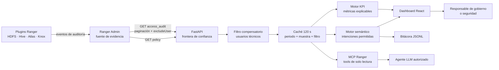
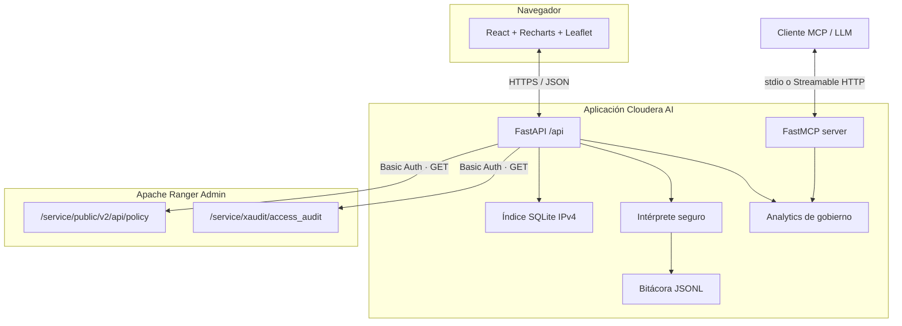

# Ranger Security Intelligence


Plataforma de observabilidad y gobierno para Apache Ranger, preparada para desplegarse como aplicación en Cloudera AI Workbench. Combina una visión ejecutiva de KPIs, trazabilidad de accesos, geolocalización y consultas en lenguaje natural sobre un perímetro estrictamente de solo lectura.

> Estado: MVP funcional. No modifica políticas de Ranger. Las credenciales permanecen en FastAPI y nunca llegan al navegador ni al modelo.

## 1. Propósito de gobierno

Apache Ranger conserva la evidencia operativa: quién accedió, a qué activo, desde dónde, mediante qué servicio y con qué decisión. Este proyecto convierte esa evidencia técnica en tres vistas complementarias:

1. **Visión ejecutiva:** indicadores OK/KO para última hora, hoy y muestra seleccionada.
2. **Visión operativa:** usuarios, servicios, recursos, IP, operaciones, políticas y últimos eventos.
3. **Visión semántica:** preguntas en español y herramientas MCP gobernadas para agentes externos.

El producto no sustituye a Ranger. Actúa como una capa de lectura, interpretación y rendición de cuentas.

## 2. Infografía del flujo de datos



La separación entre extracción, cálculo y presentación permite demostrar de dónde sale cada cifra. Es una característica de gobierno, no solo una decisión técnica.

## 3. Funcionalidad

### 3.1 Dashboard

- Ventanas temporales: 24 horas, 7 días, 30 días, 3 meses y 6 meses.
- Muestra configurable en web: 1.000, 5.000, 10.000, 30.000, 50.000 o 100.000 eventos.
- Exclusión activable de usuarios internos.
- KPIs OK/KO para última hora, hoy y muestra.
- Evolución temporal y distribución permitidos/denegados.
- Actividad y denegaciones por usuario.
- Distribución por servicio Ranger.
- Recursos más utilizados, identificados por **servicio + nombre + base de datos/ruta**.
- IP con más denegaciones.
- Últimos 100 accesos permitidos y últimos 100 denegados.
- Inventario y señales básicas de riesgo en políticas.
- Consulta de la bitácora del chat.

### 3.2 Mapa

- Las IP públicas se resuelven localmente con un catálogo IPv4 convertido a SQLite.
- Ninguna IP se envía a un servicio externo de geolocalización.
- Las IP privadas se agrupan en Calle Embajadores 181, Madrid.
- El mapa encuadra todos los puntos con aproximadamente 5 km de margen sobre los extremos.

### 3.3 Lenguaje natural

El chat no convierte texto libre en URLs, SQL ni acciones administrativas. Clasifica la pregunta dentro de un catálogo permitido y responde con:

- una conclusión textual;
- una tabla cuando aporta evidencia;
- una gráfica cuando facilita la comparación.

Ejemplos:

- `Desglosa los accesos por usuario.`
- `Usuarios que han accedido y a qué servicio.`
- `¿Qué recursos fueron los más solicitados?`
- `Dime los accesos de la última hora.`
- `Muéstrame políticas con comodines.`
- `¿Qué APIs puedes llamar?`

## 4. Visión de KPIs

| Dominio | KPI | Interpretación de gobierno |
|---|---|---|
| Acceso | OK/KO última hora | Pulso operativo y detección temprana |
| Acceso | OK/KO hoy | Situación diaria para operaciones |
| Acceso | OK/KO muestra | Postura del periodo seleccionado |
| Identidad | Accesos por usuario | Concentración de uso y cuentas dominantes |
| Identidad | Usuarios más denegados | Posible error de asignación, abuso o política incompleta |
| Activo | Recursos más usados | Activos críticos por evidencia de consumo |
| Servicio | Accesos por repositorio | Distribución de carga y superficie gobernada |
| Red | IP con denegaciones | Investigación de origen y patrones anómalos |
| Política | Políticas amplias | Comodines, exposición pública o delegación administrativa |

### Alcance y denominadores

Toda métrica se calcula sobre una **muestra explícita**, no necesariamente sobre el universo histórico. El pie de la web muestra el tamaño solicitado y la respuesta API incluye `sampleSize`. Aumentar la muestra mejora cobertura pero incrementa el coste sobre Ranger.

## 5. Arquitectura



### Decisiones principales

- **Backend for Frontend:** React solo llama a FastAPI; no conoce credenciales Ranger.
- **Solo lectura por construcción:** el cliente únicamente implementa GET de auditorías y políticas.
- **Defensa en profundidad:** `excludeUser` se envía a Ranger y vuelve a comprobarse en FastAPI.
- **Cálculos puros:** `analytics.py` no hace red, facilitando revisión y pruebas.
- **Despliegue único:** React se compila y FastAPI sirve el resultado.
- **MCP cerrado:** las tools exponen casos de gobierno concretos, no un proxy HTTP genérico.

## 6. MCP para hablar con Ranger

El servidor MCP está en `backend/mcp_server.py` y utiliza el SDK oficial de Python. Expone exclusivamente:

| Tool MCP | Función | Escritura |
|---|---|---|
| `ranger_access_kpis` | KPIs, evolución, usuarios y servicios | No |
| `ranger_top_resources` | Recursos con servicio y contexto | No |
| `ranger_recent_denials` | Denegaciones recientes para investigación | No |
| `ranger_policy_inventory` | Inventario de políticas | No |

Arranque por `stdio`:

```bash
python -m backend.mcp_server
```

Arranque con Streamable HTTP:

```bash
MCP_TRANSPORT=streamable-http python -m backend.mcp_server
```

El SDK oficial recomienda Streamable HTTP para producción y `stdio` resulta práctico para desarrollo local. Antes de exponer MCP en red debe añadirse autenticación corporativa y autorización por identidad; el hecho de que una tool sea de lectura no significa que sus datos carezcan de sensibilidad.

## 7. APIs

### APIs de Ranger utilizadas

```text
GET /service/xaudit/access_audit
GET /service/public/v2/api/policy
```

Parámetros de auditoría relevantes:

| Parámetro | Uso |
|---|---|
| `startDate`, `endDate` | Acotar el periodo |
| `pageSize`, `startIndex` | Paginar en bloques de hasta 10.000 |
| `excludeUser` | Excluir cuentas técnicas separadas por comas |
| `repositoryName` | Filtrar un servicio cuando procede |

### APIs FastAPI

| Método | Ruta | Función |
|---|---|---|
| GET | `/api/health` | Conectividad, servicios y estado geográfico |
| GET | `/api/dashboard` | KPIs y tablas gobernadas |
| GET | `/api/map` | Puntos geográficos agregados |
| POST | `/api/chat` | Pregunta semántica permitida |
| GET | `/api/logs` | Bitácora reciente del chat |
| POST | `/api/admin/build-geo-index` | Construcción controlada del índice local |
| GET | `/docs` | OpenAPI interactivo de FastAPI |

## 8. Estructura del repositorio

```text
topo-ranger-kpi-agent/
├── backend/
│   ├── analytics.py       # KPIs, recursos gobernados y filas de evidencia
│   ├── audit_log.py       # bitácora append-only JSONL
│   ├── chat.py            # contexto e intenciones de lenguaje natural
│   ├── config.py          # configuración externalizada
│   ├── geolocation.py     # índice y resolución IPv4
│   ├── main.py            # FastAPI, caché y entrega del frontend
│   ├── mcp_server.py      # tools MCP de solo lectura
│   └── ranger.py          # frontera HTTP con Ranger Admin
├── frontend/
│   ├── src/main.jsx       # dashboard, chat, tablas y mapa
│   ├── src/styles.css     # sistema visual responsive
│   └── vite.config.js     # build y proxy de desarrollo
├── scripts/
│   └── build_geo_index.py # CSV IPv4 → SQLite indexado
├── tests/
│   └── test_analytics.py  # pruebas unitarias y de contrato
├── Dockerfile             # build multi-stage Node → Python
├── start.py               # arranque local/Cloudera
├── requirements.txt
└── .env.example
```

Artefactos no versionados:

- `.env`: secretos locales.
- `data/geolocation.sqlite`: índice derivado.
- `data/chat_audit.jsonl`: evidencia operativa.
- `geolocationDatabaseIPv4.csv`: fuente geográfica de gran tamaño.

## 9. Configuración

Crear `.env` a partir de `.env.example`:

```env
RANGER_URL=https://base3.mole4.local:6182
RANGER_USER=admin
RANGER_PASSWORD=change-me
RANGER_VERIFY_SSL=false
RANGER_SERVICES=cm_hdfs,cm_knox,cm_atlas,Hadoop SQL
RANGER_AUDIT_PAGE_SIZE=5000
RANGER_TIMEOUT_SECONDS=60
RANGER_EXCLUDE_USERS=hdfs,hive,impala,kafka,nifi,spark
AUDIT_LOG_PATH=data/chat_audit.jsonl
GEO_CSV_PATH=geolocationDatabaseIPv4.csv
GEO_DB_PATH=data/geolocation.sqlite
CORS_ORIGINS=http://localhost:5173
```

En producción debe utilizarse un gestor de secretos. `RANGER_VERIFY_SSL=false` solo es aceptable en laboratorio con certificado interno no confiable; el objetivo productivo debe ser `true` con la CA corporativa instalada.

## 10. Instalación local

Requisitos:

- Python 3.11 o superior.
- Node.js 20 o superior para compilar React.
- Conectividad de red con Ranger Admin.

```bash
git clone http://nas.mole4.local:8418/smerchan/topo-ranger-kpi-agent.git
cd topo-ranger-kpi-agent
python3 -m venv .venv
source .venv/bin/activate
pip install -r requirements.txt
cp .env.example .env
```

Editar `.env` y añadir las credenciales mediante un canal seguro.

### Índice geográfico

```bash
python -m scripts.build_geo_index
```

El CSV contiene aproximadamente 2,4 millones de rangos. Se transforma una vez a SQLite para evitar recorrerlo en cada petición.

## 11. Ejecución

### Desarrollo

Terminal 1:

```bash
source .venv/bin/activate
python -m uvicorn backend.main:app --reload
```

Terminal 2:

```bash
cd frontend
npm install
npm run dev
```

Abrir `http://localhost:5173`.

### Producción local

```bash
cd frontend
npm install
npm run build
cd ..
python start.py
```

Abrir `http://localhost:8000`.

### Docker

```bash
docker build -t ranger-security-intelligence .
docker run --rm -p 8000:8000 --env-file .env ranger-security-intelligence
```

El CSV y el SQLite deben montarse como volumen si se necesita geolocalización dentro del contenedor.

### Cloudera AI Workbench

El arranque reconoce `CDSW_APP_PORT`:

```bash
python start.py
```

Recomendaciones productivas:

1. Inyectar secretos desde el mecanismo de Cloudera, no desde Git.
2. Instalar la CA que firma Ranger y activar validación TLS.
3. Limitar acceso a la app mediante identidad corporativa.
4. Persistir `data/chat_audit.jsonl` en almacenamiento gobernado.
5. Proteger o retirar `/api/admin/build-geo-index` tras construir el índice.
6. Proteger MCP con autenticación antes de usar Streamable HTTP.

## 12. Pruebas y verificación

Ejecutar:

```bash
python -m pytest -q
python -m compileall -q backend scripts start.py
cd frontend && npm run build
```

Cobertura funcional actual:

- conteos permitidos/denegados y tasa;
- ranking y normalización de recursos;
- servicio como parte de la identidad del recurso;
- interpretación natural de desglose por usuario;
- respuesta MCP/API exclusivamente de lectura;
- envío de `excludeUser`;
- paginación de auditorías;
- periodos de 3 y 6 meses;
- límite máximo de muestra;
- agrupación de IP privadas en Embajadores 181.

La prueba de integración con Ranger debe ejecutarse en una red que resuelva `base3.mole4.local`. Para evitar carga accidental, se recomienda comenzar con `pageSize=2` y aumentar progresivamente.

## 13. Trazabilidad y seguridad

### Controles implementados

- Credenciales confinadas al backend.
- Cliente Ranger con superficie GET cerrada.
- Muestra limitada a 100.000 eventos.
- Paginación en bloques de 10.000.
- Caché por periodo, muestra y filtro de identidad.
- Exclusión en origen y filtro compensatorio local.
- Chat basado en intenciones permitidas.
- MCP sin tools de escritura.
- Auditoría JSONL de pregunta, intención, respuesta, alcance y errores.
- `.env`, logs, SQLite y CSV excluidos de Git.

### Límites conocidos

- La detección de políticas riesgosas es heurística; no reemplaza una revisión formal.
- El CSV determina la precisión de la geolocalización.
- Las IP privadas se representan mediante una ubicación organizativa acordada, no su posición física real.
- La muestra puede no contener todos los eventos del periodo.
- La caché es local al proceso; un despliegue con múltiples réplicas debería usar un almacén compartido.
- El intérprete actual es determinista. Un LLM futuro debe consumir únicamente las tools MCP y conservar los mismos límites.

## 14. Evolución recomendada

1. Autenticación corporativa y roles de visualización.
2. CA corporativa y TLS estricto con Ranger.
3. Persistencia gobernada de auditoría en Kudu, Iceberg o almacenamiento corporativo.
4. Métricas comparativas respecto al periodo anterior.
5. Clasificaciones Atlas y cobertura de masking/row filters.
6. Detección de anomalías con baseline explicable.
7. OAuth 2.1 para MCP Streamable HTTP.
8. Pruebas de contrato contra la versión concreta de Ranger del cliente.

## 15. Licencia y responsabilidad

El proyecto usa componentes open source y debe incorporar la licencia corporativa elegida antes de distribuirse. Los datos de auditoría pueden contener identidades, direcciones IP y nombres de activos sensibles; su acceso, conservación y exportación deben someterse a las políticas de gobierno de la organización.
