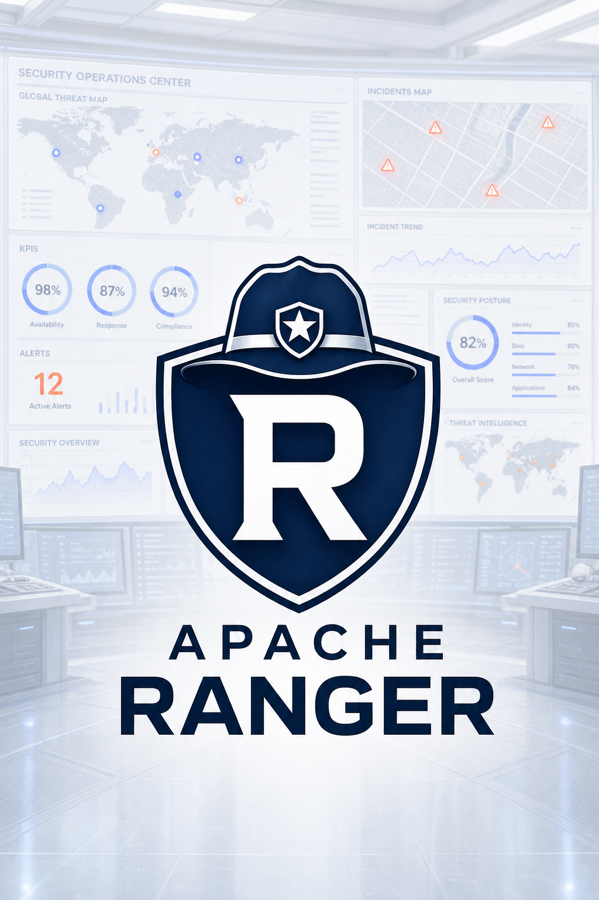
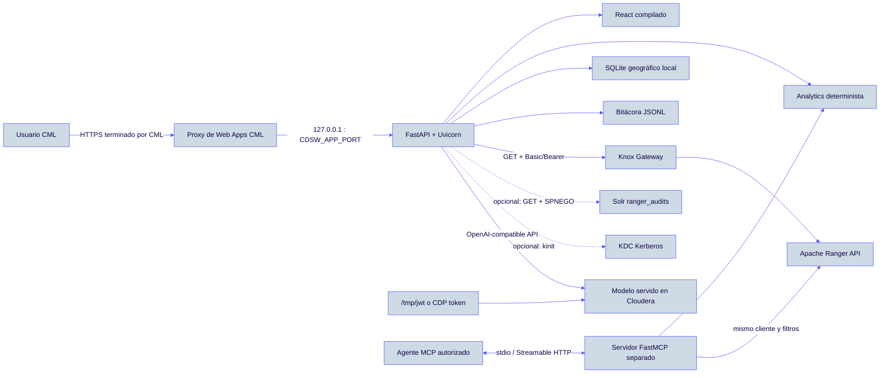
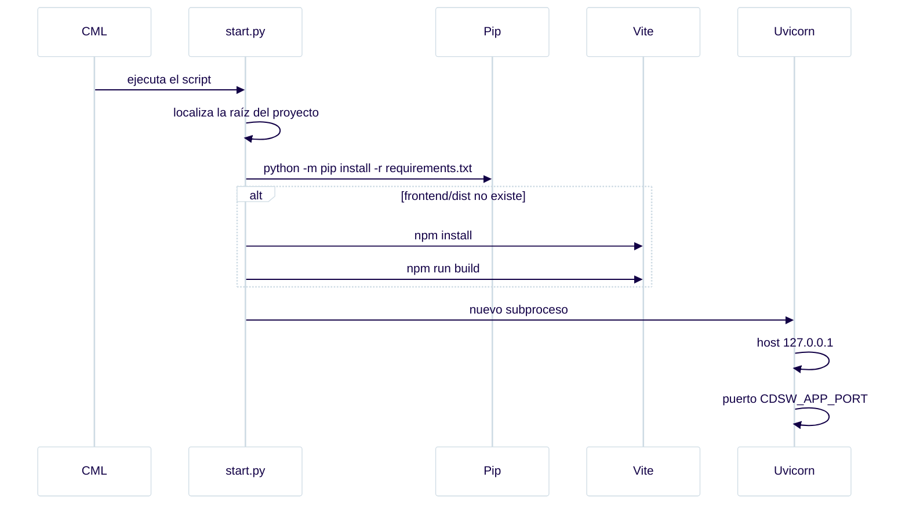
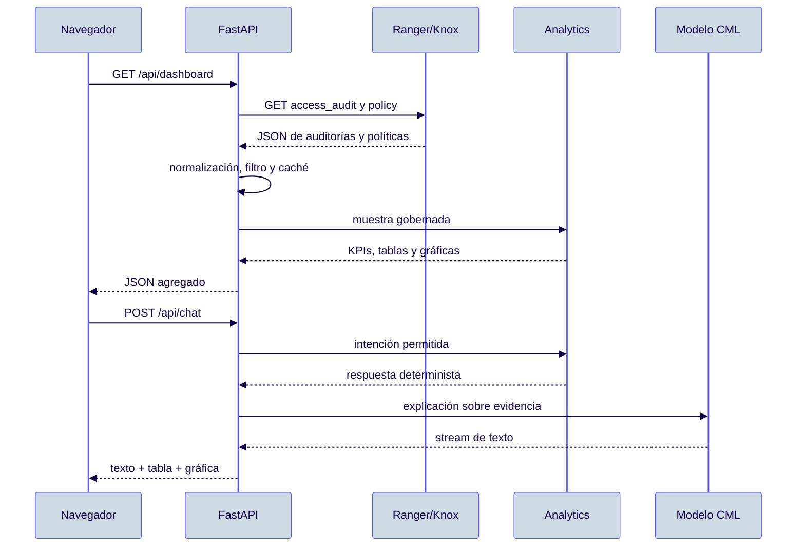

# Apache Ranger Intelligence Dashboard para Cloudera CML

<p align="center">
  
</p>

<p align="center">
  Dashboard de auditoría, gobierno y análisis de Apache Ranger preparado para ejecutarse como una Web App de Cloudera Machine Learning.
</p>

> **Estado del proyecto:** primera versión funcional para pruebas en CML. La
> aplicación es de solo lectura, funciona con Ranger publicado mediante Knox,
> permite configurar las conexiones desde la web y está preparada para
> convertirse en un Applied ML Prototype (AMP) en el siguiente paso.

---

## 1. Objetivo

Apache Ranger conserva la evidencia de quién accede a los datos, qué servicio
utiliza, qué recurso solicita, desde qué IP realiza la petición y si el acceso
es permitido o denegado. Este proyecto transforma esa evidencia técnica en:

- indicadores operativos de accesos permitidos y denegados;
- evolución temporal, rankings y distribuciones;
- análisis por usuario, servicio, recurso, operación e IP;
- visualización geográfica sin enviar direcciones IP a servicios externos;
- consulta en lenguaje natural mediante un modelo desplegado en Cloudera;
- herramientas MCP de gobierno para agentes externos autorizados.

La aplicación **no sustituye a Apache Ranger** y no modifica políticas. Los
clientes de Ranger, Solr y MCP están diseñados para operaciones de lectura.

## 2. Tecnologías y versiones

| Capa | Tecnología | Versión o requisito |
|---|---|---|
| Runtime CML | Python | **3.10 compatible**; Python 3.11 también compatible |
| API | FastAPI | `0.138.2` |
| Servidor ASGI | Uvicorn | `0.38.0` |
| Configuración | Pydantic Settings | `2.12.0` |
| HTTP | Requests | `2.32.3` |
| MCP | MCP Python SDK | `>=1.27,<2` |
| Interfaz | React + Vite | bundle compilado incluido en `frontend/dist` |
| Gráficas | Recharts | instalado por `frontend/package-lock.json` |
| Mapas | Leaflet + React Leaflet | instalado por `frontend/package-lock.json` |
| Node.js | Solo para recompilar React | Node.js 20 o superior; no es necesario si `frontend/dist` existe |

### Python 3.10 o 3.11

El runtime objetivo de CML puede ser Python 3.10. No se utilizan características
exclusivas de Python 3.11. También se puede seleccionar Python 3.11 si está
disponible en el workspace. Para reproducibilidad, el primer AMP utilizará
Python 3.10 como línea base.

## 3. Identidad visual Cloudera

La interfaz utiliza la paleta corporativa acordada:

| Color | Hexadecimal | Uso |
|---|---:|---|
| <span style="display:inline-block;width:18px;height:18px;background:#FF550D;border-radius:4px"></span> Cloudera Orange | `#FF550D` | acciones principales, riesgo y acentos |
| <span style="display:inline-block;width:18px;height:18px;background:#120046;border-radius:4px"></span> Twilight | `#120046` | títulos, navegación y fondos de alto contraste |
| <span style="display:inline-block;width:18px;height:18px;background:#5555F9;border-radius:4px"></span> Blue Nova | `#5555F9` | actividad, controles y estados informativos |
| <span style="display:inline-block;width:18px;height:18px;background:#CEDBE4;border:1px solid #999;border-radius:4px"></span> Pewter | `#CEDBE4` | bordes, superficies y fondos secundarios |
| Blanco | `#FFFFFF` | limpieza visual y contraste |
| Negro | `#000000` | texto principal |

El recurso principal es
[`topo_ranger_apache.png`](./topo_ranger_apache.png): el emblema de Apache
Ranger destaca sobre un centro de operaciones con pantallas aclaradas. Las
tarjetas de servicio incluyen además los logos locales de Apache Atlas, Apache
Hive y Apache Hadoop/HDFS.

## 4. Arquitectura general



### 4.1 Frontera de confianza

FastAPI es el Backend for Frontend. El navegador nunca recibe:

- contraseñas de Ranger;
- tokens de Ranger;
- CDP tokens;
- API keys del modelo;
- contraseñas o keytabs Kerberos.

React recibe únicamente configuración pública, estados de conexión y datos
agregados. Los secretos permanecen en memoria del proceso y los campos se
vuelven a mostrar vacíos al abrir Configuración. Un campo secreto vacío durante
una actualización conserva el valor previamente almacenado.

### 4.2 Fuentes de auditoría

La fuente predeterminada es **Ranger mediante Knox**, adecuada para Cloudera.
La aplicación llama a:

```text
GET {RANGER_URL}/service/xaudit/access_audit
GET {RANGER_URL}/service/public/v2/api/policy
```

Como alternativa avanzada se puede seleccionar **Solr directo**:

```text
GET https://{SOLR_SERVER}:{SOLR_PORT}/solr/{SOLR_COLLECTION}/select
```

Kerberos está desactivado por defecto. Solo se ejecuta `kinit` y se añade
`curl --negotiate` cuando el interruptor Kerberos está activado.

### 4.3 Modelo LLM

El cliente utiliza el contrato compatible con OpenAI:

```text
POST {AI_GATEWAY_API_URL}/chat/completions
```

La credencial se selecciona en este orden:

1. CDP token introducido expresamente en la web;
2. `access_token` del fichero `/tmp/jwt` de la sesión CML;
3. API key introducida manualmente;
4. ninguna credencial.

El modelo predeterminado es:

```text
nvidia/nemotron-3-nano
```

La comprobación inicial envía:

```json
{
  "model": "nvidia/nemotron-3-nano",
  "messages": [{"role": "user", "content": "Responde únicamente OK"}],
  "temperature": 0.2,
  "top_p": 0.7,
  "max_tokens": 64,
  "stream": true
}
```

Se aceptan respuestas SSE y respuestas JSON compatibles. Si no aparece texto,
el diagnóstico informa del tipo de contenido, número de eventos, claves
recibidas, `finish_reason` y fragmentos de razonamiento, sin mostrar el token.

El agente es **híbrido y gobernado**: `chat.py` calcula primero una evidencia
determinista sobre las auditorías permitidas y el modelo real redacta la
explicación. Si el endpoint LLM no responde, la tabla y la gráfica calculadas
siguen disponibles como respaldo. El chat reconoce, entre otras, estas
preguntas:

- `¿Qué tabla tiene más accesos rechazados?`
- `¿Qué columna se está rechazando más?`
- `¿Qué usuarios tienen más denegaciones?`
- `¿Qué recursos fueron los más solicitados?`

Los recursos Hive con `resType=@column` se interpretan como
`base_datos/tabla/columna`. El ranking por tabla agrega las denegaciones de
todas sus columnas sin confundirlas con rutas HDFS.

## 5. Arranque autocontenido en CML

CML permite indicar un único fichero Python. El fichero es:

```text
start.py
```

El proceso completo es:



### Por qué se usa un subproceso

Algunas Web Apps de CML ejecutan el fichero como celdas dentro de IPython. En
ese contexto ya existe un bucle `asyncio`; llamar directamente a
`uvicorn.run()` produciría:

```text
RuntimeError: asyncio.run() cannot be called from a running event loop
```

`start.py` inicia Uvicorn mediante `subprocess.run`, aislando su bucle de
eventos.

### Detección de la carpeta raíz

El proyecto puede llegar a CML de dos maneras:

- clonado desde Git, con los ficheros directamente en `CDSW_PROJECT_HOME`;
- cargado como carpeta, creando
  `CDSW_PROJECT_HOME/topo-ranger-kpi-agent-cloudera-amp/`.

`find_project_root()` comprueba ambos formatos y hasta dos niveles de
subcarpetas. La raíz válida debe contener:

```text
requirements.txt
backend/main.py
frontend/
```

### Host y puerto

La aplicación escucha obligatoriamente en:

```text
host = 127.0.0.1
port = CDSW_APP_PORT
```

Si `CDSW_APP_PORT` no existe, se utiliza `APP_PORT` y finalmente `8000`.
No se configura TLS en Uvicorn dentro de CML: el proxy de Cloudera termina
HTTPS.

## 6. Despliegue manual como Web App CML

### 6.1 Requisitos

- Proyecto CML con permiso para crear una Web App.
- Runtime Python 3.10 o 3.11.
- Recursos recomendados para la primera prueba: 4 CPU y 8 GiB de memoria.
- Acceso de red desde el runtime hacia Knox/Ranger y el endpoint del modelo.
- Node.js únicamente si se elimina `frontend/dist`; el repositorio ya incluye
  el frontend compilado.
- `curl`, `kinit` y `klist` solo si se activa Solr directo con Kerberos.

### 6.2 Procedimiento

1. Importar el repositorio en CML o subir la carpeta completa.
2. Crear una nueva **Application / Web App**.
3. Seleccionar Python 3.10 o Python 3.11.
4. Indicar `start.py` como script.
5. Asignar 4 CPU y 8 GiB de memoria.
6. Iniciar la aplicación.
7. Abrir la URL publicada por CML.
8. Entrar en **Configuración**, completar conexiones y pulsar
   **Guardar y aplicar**.
9. Revisar los semáforos `API RANGER`, `SOLR` y `MODELO`.

En cada reinicio del contenedor se reinstalan las dependencias Python antes de
levantar el servidor. Esto responde al modelo efímero de los runtimes CML.

## 7. Configuración desde la interfaz

Cada parámetro dispone de un icono de interrogación con descripción y ejemplo.

### 7.1 Apache Ranger / Knox

| Campo | Descripción |
|---|---|
| URI de Ranger | URL base publicada por Knox o URL completa de `access_audit`; ambos formatos se normalizan |
| Autenticación | `basic`, `bearer` o `none` |
| Usuario | usuario técnico o usuario de workload |
| Contraseña | valor de `WORKLOAD_PASSWORD`; se genera en **User Settings** de Cloudera |
| Token Ranger | token Bearer aceptado por Knox/Ranger |

Ejemplo de URL:

```text
https://gateway.example.cloudera.site/environment/cdp-proxy-token/ranger
```

También se acepta:

```text
https://gateway.example.cloudera.site/service/xaudit/access_audit
```

Si se introduce el endpoint completo, la aplicación elimina internamente
`/service/xaudit/access_audit` para obtener la base y evita duplicar la ruta.
Esto permite usar después esa misma base para consultar políticas.

### 7.2 Auditoría

| Campo | Descripción |
|---|---|
| Origen | API Ranger vía Knox o Solr directo |
| Servidor Solr | DNS/IP sin protocolo |
| Puerto | puerto HTTPS de Solr |
| Colección | normalmente `ranger_audits` |

Aunque Solr no esté disponible, la aplicación puede trabajar con la API de
Ranger cuando el origen seleccionado es `ranger`.

### 7.3 Kerberos opcional

Para Knox, el interruptor debe permanecer **apagado**. Al activarlo se solicitan:

- usuario;
- realm;
- servidor KDC;
- admin server;
- contraseña o ruta de keytab;
- ruta de caché de credenciales;
- ruta del `krb5.conf` privado.

Con contraseña:

```text
kinit -c {KERBEROS_CCACHE} usuario@REALM
```

Con keytab:

```text
kinit -kt {KERBEROS_KEYTAB} -c {KERBEROS_CCACHE} usuario@REALM
```

La contraseña se entrega por entrada estándar y no forma parte del comando.

### 7.4 Modelo

| Campo | Descripción |
|---|---|
| URI compatible con OpenAI | base URL del endpoint; se añade `/chat/completions` |
| API key | credencial manual compatible con el endpoint |
| CDP token | token de CDP, con prioridad sobre la API key |
| Usar `/tmp/jwt` | lee automáticamente el token temporal de CML |
| Modelos | identificadores separados por comas |
| Modelo predeterminado | debe existir en la lista anterior |

El chat incorpora además **Configurar agente**, que permite alternar durante
la sesión entre AI Gateway/LiteLLM y Cloudera AI Inference. El token introducido
nunca vuelve al navegador y el log solo registra si fue actualizado. Un valor
vacío conserva la credencial actual. Para que el cambio persista tras reiniciar
el AMP deben configurarse las variables de entorno.

## 8. Variables de entorno

La web permite modificar los campos operativos en memoria. Para establecer
valores al arrancar se pueden usar variables del proyecto CML:

```env
RANGER_URL=https://gateway.example.cloudera.site/environment/cdp-proxy-token/ranger
RANGER_AUTH_TYPE=basic
RANGER_USER=usuario-workload
RANGER_PASSWORD=
RANGER_TOKEN=
RANGER_VERIFY_SSL=false
RANGER_SERVICES=cm_hdfs,cm_hive,cm_atlas,cm_knox
RANGER_EXCLUDE_USERS=hdfs,hive,impala,kafka,nifi,spark

AUDIT_SOURCE=ranger
SOLR_SERVER=
SOLR_PORT=8995
SOLR_COLLECTION=ranger_audits

KERBEROS_ENABLED=false
KERBEROS_USER=
KERBEROS_REALM=
KERBEROS_KDC=
KERBEROS_ADMIN_SERVER=
KERBEROS_PASSWORD=
KERBEROS_KEYTAB=
KERBEROS_CCACHE=data/krb5cc_ranger_solr
KERBEROS_CONFIG_FILE=data/krb5_ranger_solr.conf

AI_GATEWAY_API_URL=https://ml.example.cloudera.site/namespaces/serving-default/endpoints/my-model/v1
AI_GATEWAY_TOKEN=
CDP_TOKEN=
USE_CML_JWT=true
CML_JWT_PATH=/tmp/jwt
AI_GATEWAY_MODELS=nvidia/nemotron-3-nano
AI_GATEWAY_DEFAULT_MODEL=nvidia/nemotron-3-nano
AGENT_PROVIDER=cloudera
CLOUDERA_AI_API_URL=
CLOUDERA_AI_TOKEN=
CLOUDERA_AI_MODELS=
CLOUDERA_AI_DEFAULT_MODEL=

SERVER_IP=127.0.0.1
APP_PORT=8000
```

No se deben versionar `.env`, `.env.cml`, tokens, contraseñas, keytabs ni
cachés Kerberos. Ambos ficheros `.env` están incluidos en `.gitignore`.

## 9. Autenticación de usuarios de la Web App

El backend busca primero la identidad propagada por Cloudera en cabeceras como
`REMOTE-USER`. Cuando existe:

- no se presenta el formulario local;
- la interfaz muestra `Cloudera: nombre-usuario`;
- el acceso efectivo sigue dependiendo de los permisos de la Web App CML.

Si no se detecta una identidad de Cloudera, se utiliza el login local solo
cuando `APP_AUTH_PASSWORD_HASH` está configurado. La sesión local usa:

- hash scrypt;
- cookie firmada `HttpOnly`;
- `SameSite=Strict`;
- duración configurable;
- limitación de intentos.

Generación local del hash:

```bash
python -m scripts.hash_password
```

Para una lista cerrada de administradores deberá añadirse en el siguiente paso
una allowlist que valide el usuario CML detectado antes de servir la aplicación.

## 10. Semáforos y diagnóstico

La esquina inferior muestra tres comprobaciones independientes:

| Semáforo | Comprobación |
|---|---|
| API RANGER | llamada real de lectura a auditorías de Ranger |
| SOLR | consulta `rows=0` a la colección configurada |
| MODELO | completion mínima compatible con OpenAI |

Se ejecutan:

- al iniciar la interfaz;
- al pulsar el botón de recarga;
- después de guardar la configuración.

Al pasar el ratón sobre cada estado se muestra la latencia o el error.

### Diagnóstico de Ranger

Los mensajes distinguen:

1. no se llega a la URL: DNS, red, timeout o SSL;
2. se llega, pero el usuario/contraseña no son correctos: HTTP 401;
3. el usuario está autenticado, pero no tiene permisos: HTTP 403;
4. se llega y la API devuelve otro error HTTP;
5. HTTP 200 sin JSON: respuesta vacía, HTML o redirección de Knox.

### Diagnóstico del modelo

Un HTTP correcto sin texto puede indicar que el modelo agotó los tokens en
razonamiento, que devolvió otro esquema o que el proxy no entregó SSE. El
tooltip incluye estructura segura de la respuesta para diferenciar estos casos.

## 11. Componentes del dashboard

- KPIs permitidos/denegados de última hora, día y muestra.
- Ventanas de 24 h, 7 días, 30 días, 3 meses y 6 meses.
- Muestras de 1.000 a 100.000 auditorías.
- Evolución temporal.
- Distribución de decisiones.
- Recursos por servicio y por usuario.
- Logos automáticos para `cm_atlas`, `cm_hive` y `cm_hdfs`.
- Actividad y concentración por identidad.
- identidades con mayor volumen de denegaciones.
- tabla de recursos utilizados.
- IP con mayor número de denegaciones.
- últimos 100 accesos permitidos y denegados.
- mapa local de IP.
- chat de gobierno sobre la evidencia.
- registro de actividad.

Las tablas y gráficas se calculan de forma determinista. El LLM redacta una
explicación sobre esa evidencia; no calcula los KPIs ni recibe credenciales.

## 12. Flujo de una consulta del dashboard



La caché se separa por periodo, tamaño de muestra y filtro de usuarios para
evitar mezclar universos distintos.

## 13. API FastAPI

| Método | Ruta | Función |
|---|---|---|
| `POST` | `/api/auth/login` | login local de respaldo |
| `GET` | `/api/auth/session` | identidad CML o sesión local |
| `POST` | `/api/auth/logout` | cierre de sesión local |
| `GET` | `/api/health` | salud de la fuente activa |
| `GET` | `/api/diagnostics` | estados API Ranger, Solr y modelo |
| `GET` | `/api/config` | configuración pública, nunca secretos |
| `POST` | `/api/config` | actualiza configuración en memoria |
| `GET` | `/api/dashboard` | KPIs, tablas y distribuciones |
| `GET` | `/api/map` | puntos geográficos agregados |
| `POST` | `/api/chat` | consulta semántica gobernada |
| `POST` | `/api/agent/config` | perfil temporal del agente sin exponer secretos |
| `GET` | `/api/logs` | registro reciente |
| `POST` | `/api/admin/build-geo-index` | construcción del índice IPv4 |
| `GET` | `/docs` | Swagger protegido |
| `GET` | `/openapi.json` | contrato OpenAPI protegido |

## 14. MCP: herramientas para agentes

El servidor está en `backend/mcp_server.py` y utiliza `FastMCP`. No se inicia
automáticamente con la Web App porque CML ejecuta `start.py` como un único
servidor web. MCP debe desplegarse como proceso o tarea independiente cuando se
quiera conectar un agente.

### Herramientas expuestas

| Tool | Parámetros principales | Resultado | Escritura |
|---|---|---|---|
| `ranger_access_kpis` | periodo, muestra, excluir internos | resumen, timeline, usuarios y servicios | No |
| `ranger_top_resources` | periodo, muestra, límite | recursos, servicio, contexto y accesos | No |
| `ranger_recent_denials` | periodo, muestra, límite | denegaciones recientes | No |
| `ranger_policy_inventory` | servicio opcional | inventario de políticas | No |

### Funcionamiento

1. El cliente MCP solicita una tool.
2. `_snapshot()` limita la muestra entre 100 y 100.000.
3. Se reutiliza `load()` de FastAPI.
4. Se aplican los mismos filtros, caché y clientes que en la web.
5. `analytics.dashboard()` produce la misma definición de los KPIs.
6. La tool devuelve JSON estructurado.

No existe una tool que acepte una URL, consulta Solr o acción Ranger
arbitraria. Esto evita convertir MCP en un proxy administrativo.

El servidor MCP no llama directamente al LLM configurado en la Web App. Su
responsabilidad es entregar evidencia estructurada al cliente MCP; el agente
que realiza la llamada decide cómo incorporar esa evidencia a su contexto.

### Ejemplos de llamadas MCP

KPIs de los últimos siete días:

```json
{
  "tool": "ranger_access_kpis",
  "arguments": {
    "period": "7d",
    "sample_size": 5000,
    "exclude_internal": true
  }
}
```

Recursos más utilizados:

```json
{
  "tool": "ranger_top_resources",
  "arguments": {
    "period": "30d",
    "sample_size": 10000,
    "exclude_internal": true,
    "limit": 20
  }
}
```

Denegaciones recientes:

```json
{
  "tool": "ranger_recent_denials",
  "arguments": {
    "period": "24h",
    "sample_size": 5000,
    "exclude_internal": true,
    "limit": 50
  }
}
```

Inventario de políticas de HDFS:

```json
{
  "tool": "ranger_policy_inventory",
  "arguments": {
    "service": "cm_hdfs"
  }
}
```

Forma resumida de la respuesta de KPIs:

```json
{
  "scope": {
    "period": "7d",
    "sampleSize": 5000,
    "excludeInternal": true
  },
  "summary": {
    "total": 5000,
    "allowed": 4800,
    "denied": 200
  },
  "timeline": [],
  "accessesByUser": [],
  "serviceDistribution": []
}
```

Las cifras anteriores son únicamente un ejemplo de estructura, no datos reales
del entorno.

### Arranque por stdio

```bash
python -m backend.mcp_server
```

Ejemplo conceptual de configuración de un cliente MCP:

```json
{
  "mcpServers": {
    "ranger-governance": {
      "command": "python",
      "args": ["-m", "backend.mcp_server"],
      "cwd": "/ruta/al/proyecto"
    }
  }
}
```

### Arranque Streamable HTTP

```bash
MCP_TRANSPORT=streamable-http python -m backend.mcp_server
```

Antes de publicar MCP en red se debe añadir autenticación corporativa,
autorización por usuario, TLS y control de acceso a los datos devueltos.

## 15. Geolocalización

El CSV IPv4 se transforma a SQLite:

```bash
python -m scripts.build_geo_index
```

Ventajas:

- no se envían IP a servicios externos;
- la consulta es local;
- el fichero grande no se recorre en cada petición;
- las IP privadas pueden agruparse en una ubicación organizativa acordada.

El CSV original y la base SQLite son artefactos grandes. Para las primeras
pruebas CML pueden omitirse si no se necesita el mapa.

## 16. Estructura del proyecto

```text
topo-ranger-kpi-agent-cloudera-amp/
├── backend/
│   ├── analytics.py       # KPIs y agregaciones deterministas
│   ├── agent_runtime.py   # perfiles LiteLLM/Cloudera sin exponer secretos
│   ├── audit_log.py       # bitácora JSONL
│   ├── auth.py            # identidad CML y sesión local
│   ├── chat.py            # intenciones permitidas
│   ├── config.py          # configuración CML
│   ├── geolocation.py     # índice IPv4
│   ├── llm.py             # cliente del modelo compatible con OpenAI
│   ├── main.py            # FastAPI, API y frontend
│   ├── mcp_server.py      # servidor MCP de solo lectura
│   ├── ranger.py          # cliente Ranger/Knox
│   └── solr.py            # cliente Solr y Kerberos opcional
├── frontend/
│   ├── dist/              # frontend compilado usado por CML
│   └── src/
│       ├── assets/        # logos Apache incluidos localmente
│       ├── main.jsx       # interfaz React
│       └── styles.css     # paleta Cloudera y responsive
├── scripts/
│   ├── build_geo_index.py
│   ├── generate_self_signed_cert.py
│   └── hash_password.py
├── tests/                 # pruebas de analytics, auth y conexiones
├── start.py               # único script de la Web App CML
├── requirements.txt
├── .env.example
├── Dockerfile
└── topo_ranger_apache.png
```

## 17. Desarrollo y pruebas locales

```bash
python3.10 -m venv .venv
source .venv/bin/activate
python -m pip install -r requirements.txt
cp .env.example .env
python start.py
```

Para recompilar React:

```bash
npm install --prefix frontend
npm run build --prefix frontend
```

Verificación completa:

```bash
python -m pytest -q
python -m compileall -q backend scripts start.py
npm run build --prefix frontend
git diff --check
```

Estado de la suite en esta versión:

```text
33 passed
Frontend Vite: build correcto
```

La prueba definitiva de red, identidad CML, Knox y modelo solo puede realizarse
en la plataforma Cloudera del entorno objetivo.

## 18. Seguridad

### Controles implementados

- superficie de Ranger limitada a GET;
- tools MCP de solo lectura;
- credenciales confinadas al backend;
- secretos no devueltos por `/api/config`;
- `/tmp/jwt` leído únicamente en servidor;
- cookie local `HttpOnly` y firmada;
- límite de intentos de login;
- muestra máxima de 100.000;
- filtros de usuarios técnicos;
- bitácora JSONL;
- `.env`, `.env.cml`, keytabs y cachés fuera de Git;
- diagnósticos sin mostrar credenciales ni respuestas completas;
- frontend compilado servido por FastAPI.

### Recomendaciones para producción

1. Activar validación TLS con la CA corporativa.
2. Guardar secretos como variables seguras del proyecto CML.
3. Restringir la Web App a administradores autorizados.
4. Persistir la bitácora en almacenamiento gobernado.
5. Revisar la sensibilidad de auditorías antes de habilitar MCP.
6. Proteger o retirar la construcción del índice geográfico.
7. Establecer versiones fijas de dependencias frontend.

## 19. Diagnóstico habitual

| Mensaje | Interpretación | Acción |
|---|---|---|
| `No se encontró la carpeta...` | CML cargó una carpeta incompleta | comprobar `requirements.txt`, `backend/` y `frontend/` |
| `requirements.txt not found` | raíz de proyecto incorrecta | usar el `start.py` actualizado |
| `asyncio.run() cannot be called...` | Uvicorn se inició dentro del loop de IPython | ejecutar mediante el subproceso de `start.py` |
| `No se llegó a la URL de Ranger` | DNS, red, timeout o SSL | revisar URL y conectividad desde CML |
| HTTP 401 Ranger | usuario o `WORKLOAD_PASSWORD` incorrectos | regenerar la contraseña en User Settings |
| HTTP 403 Ranger | usuario sin permisos | revisar roles y políticas |
| HTTP 200 sin JSON | ruta Knox incorrecta, HTML o redirección | comprobar URL `cdp-proxy-token/ranger` |
| modelo sin contenido | stream sin `content` o tokens agotados en razonamiento | revisar tooltip y aumentar límite si procede |
| `kinit` no encontrado | Kerberos activado sin cliente instalado | apagar Kerberos para Knox o instalar herramientas |

## 20. Preparación del futuro AMP

El repositorio todavía no contiene el descriptor AMP definitivo. El siguiente
paso será añadir un YAML similar a:

```yaml
name: Apache Ranger Intelligence AMP
description: "Dashboard de auditoría y gobierno de Apache Ranger para CML."
author: "smerchanmole"
specification_version: 1.0
prototype_version: 1.0

runtimes:
- editor: JupyterLab
  kernel: Python 3.10
  edition: Standard

tasks:
- type: start_application
  name: Ranger Intelligence
  subdomain: ranger-intelligence
  script: start.py
  kernel: python3
  short_summary: "Dashboard Apache Ranger"
  long_summary: "Auditoría, KPIs, diagnóstico y análisis de Ranger mediante Knox."
  cpu: 4
  memory: 8
```

El AMP deberá añadir variables configurables sin incluir valores secretos y
mantener `start.py` como punto único de instalación y arranque.

## 21. Límites conocidos

- La configuración introducida en la web vive en memoria y se pierde al
  reiniciar el contenedor.
- La disponibilidad real depende de la red y permisos del entorno CML.
- Solr directo puede no estar publicado desde la red del runtime.
- La geolocalización depende de la calidad del CSV.
- El LLM solo redacta sobre la evidencia recibida; puede no estar disponible.
- La caché es local al proceso.
- MCP aún no dispone de autenticación corporativa propia.
- La allowlist de administradores CML queda para el siguiente paso.

---

Apache, Apache Ranger, Apache Atlas, Apache Hive, Apache Hadoop y sus logos son
marcas de The Apache Software Foundation. Cloudera y sus marcas pertenecen a
Cloudera, Inc. El uso de los logos en esta aplicación identifica los servicios
integrados y no implica respaldo.
